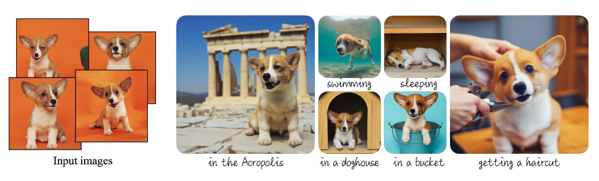

# DreamBooth

[DreamBooth](https://dreambooth.github.io/) is a pioneering project from Google, designed with the intent of personalizing the outcomes generated by large text-to-image models. As an example, you can refine the generative model utilizing a handful of your dog's pictures and subsequently prompt it to generate innovative images wherein your dog is the central character.

The original DreamBooth project uses the Imagen text-to-image model. However, given that Imagen is not an open-source model, the wider community has pivoted towards using Stable Diffusion to develop applications akin to DreamBooth. This tutorial is designed to guide you in creating your own rendition of DreamBooth, utilizing Stable Diffusion.

## What You'll Need
To complete the tutorial follow the steps below:

- Login to you EzAF cluster.
- Create a new notebook server using the `jupyter-data-science` image.
- Clone the repository locally.
- Launch the `dreambooth.ipynb` notebook file and follow the instructions.

## References

1. [DreamBooth web site](https://dreambooth.github.io/)
1. [Ruiz, N., Li, Y., Jampani, V., Pritch, Y., Rubinstein, M. and Aberman, K., 2022. Dreambooth: Fine tuning text-to-image diffusion models for subject-driven generation. arXiv preprint arXiv:2208.12242.]([https://arxiv.org/abs/1509.02971](https://arxiv.org/abs/2208.12242))
